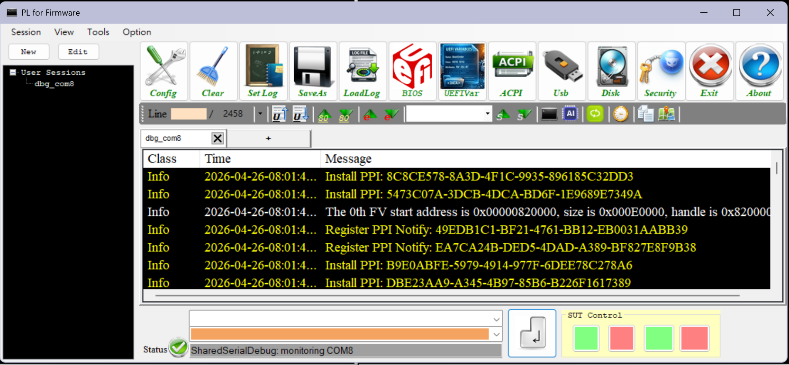
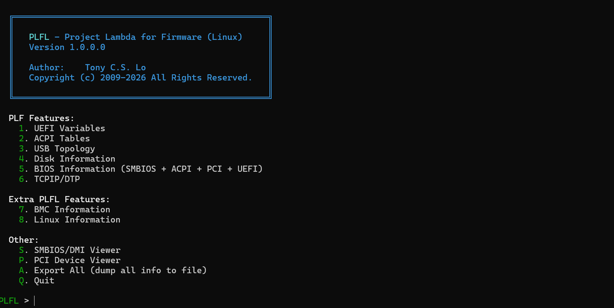

- [Firmware Tools Maintained by TonyLo](#firmware-tools-maintained-by-tonylo)
  - [Tools](#tools)
    - [---------- PL for UEFI (PLe) ----------](#-----------pl-for-uefi-ple-----------)
      - [Overview](#overview)
      - [Latest Version: **1.0.0.0** ](#latest-version-1000-)
      - [OS: **UEFI (x64/Aarch64/RiscV)**](#os-uefi-x64aarch64riscv)
      - [Features](#features)
    - [---------- PL ----------](#-----------pl-----------)
      - [Overview](#overview-1)
      - [Latest Version: **1.5.0.10**](#latest-version-15010)
      - [OS: **DOS**](#os-dos)
      - [Features](#features-1)
    - [---------- PL for Firmware (PLf) ----------](#-----------pl-for-firmware-plf-----------)
      - [Overview](#overview-2)
      - [Latest Version: **2.0.1.0**](#latest-version-2010)
      - [OS: **Windows**](#os-windows)
      - [Features](#features-2)
        - [1. Smart Debug Log Information (Main Window)](#1-smart-debug-log-information-main-window)
        - [2. Multi-Session Management](#2-multi-session-management)
          - [Creating a Session](#creating-a-session)
          - [Session Types](#session-types)
          - [Session Tabs](#session-tabs)
          - [Connect / Disconnect](#connect--disconnect)
          - [DTP Serial Transport](#dtp-serial-transport)
      - [Main Button Panel](#main-button-panel)
        - [1. UEFI/BIOS Information Viewer](#1-uefibios-information-viewer)
        - [2. UEFI Variable Viewer](#2-uefi-variable-viewer)
        - [3. ACPI Viewer](#3-acpi-viewer)
        - [4. USB](#4-usb)
          - [USB Topology Viewer](#usb-topology-viewer)
          - [USB Commander](#usb-commander)
        - [5. Disk](#5-disk)
        - [6. Security / Cryptography Tools](#6-security--cryptography-tools)
          - [Key Management](#key-management)
          - [Hash](#hash)
          - [Cipher](#cipher)
          - [Digital Signing](#digital-signing)
          - [Certificate](#certificate)
        - [7. Firmware Commander (with File Manager)](#7-firmware-commander-with-file-manager)
          - [Layout](#layout)
          - [Container Features](#container-features)
          - [Navigation](#navigation)
          - [Menus](#menus)
        - [8. Configuration / Options](#8-configuration--options)
          - [Serial Port Settings](#serial-port-settings)
          - [TCP/IP (DTP) Settings](#tcpip-dtp-settings)
          - [Color Settings](#color-settings)
          - [General Settings](#general-settings)
          - [Log Options](#log-options)
          - [GUID Path Settings](#guid-path-settings)
          - [SUT Control Configuration](#sut-control-configuration)
          - [Hotkey Configuration](#hotkey-configuration)
      - [Other GUI Functions](#other-gui-functions)
        - [1. SUT Control (System Under Test / Motherboard Control)](#1-sut-control-system-under-test--motherboard-control)
        - [2. Additional Features](#2-additional-features)
      - [Tool Bar Functions](#tool-bar-functions)
        - [1. AI Chat](#1-ai-chat)
        - [2. Console Redirection](#2-console-redirection)
      - [Command Line Interface](#command-line-interface)
        - [1. Command Line Interface (CLI Mode)](#1-command-line-interface-cli-mode)
      - [Test Features](#test-features)
    - [---------- PL for Firmware (Linux) ----------](#-----------pl-for-firmware-linux-----------)
      - [Overview](#overview-3)
      - [Latest Version: **1.0.0.0**](#latest-version-1000)
      - [OS: **Linux**](#os-linux)
      - [Requirements](#requirements)
      - [Pre-built Binary](#pre-built-binary)
      - [Usage](#usage)
        - [Interactive Mode](#interactive-mode)
        - [Command-Line Mode](#command-line-mode)
      - [Options](#options)
      - [Features](#features-3)


# Firmware Tools Maintained by TonyLo

## Tools

Visit https://ubios.blogspot.com/ to see more details.






### ---------- PL for UEFI (PLe) ----------
https://github.com/vangoghynot/tools/tree/master/Tools/PLe<br>


#### Overview
PLe (Project Lambda for UEFI) is an UEFI shell application for firmware (BIOS/BMC...etc) debugging and system inspection. It is the UEFI port of PL (Project Lambda).

#### Latest Version: **1.0.0.0** <br>
#### OS: **UEFI (x64/Aarch64/RiscV)**
#### Features
- **1.	PCI/PCI Express Register and Data Decode**
- **2.	System Memory Viewer** 
- **3.	ACPI Table Viewer**
- **4.	SMBIOS Table Viewer**
- **5.	CPU Information**
- **6.	UEFI System Tables/Handles/Variables/PCDs**
- **7.	UEFI Commander**
  <br> UEFI Protocols readiness check

### ---------- PL ----------
https://github.com/vangoghynot/tools/tree/master/Tools/PL<br>


#### Overview
PL (Project Lambda) is a DOS application for firmware (BIOS/BMC...etc) debugging and system inspection. 

#### Latest Version: **1.5.0.10**

#### OS: **DOS**

#### Features
- **1.	PCI Bus/Device Information(PCI register read/write)**
- **2.	USB host controller information** 
- **3.	System memory read/write** 
- **4.	I/O address read/write**
- **5.	Index IO read/write**
- **6.	HD-Audio Controller Information**
  <br>(Include immediate VERB command, save codec cmd sequence as c file)
- **7.	AC97 Controller** 
- **8.	ACPI Table** 
- **9.	Disk read/write** 
- **10.	Int15h E820 maps advanced browsing**
- **11.	Multi Processor(MP) Table dump** 
- **12. Advanced Browsing experience** 
  <br> &nbsp;&nbsp;&nbsp; - Goto alternative view (Alt+G) Example: PCI<>IO or Memory, ACPI<>Memory<br>&nbsp;&nbsp;&nbsp; - Go back previous view(Alt+B)<br> 
- **13. Save View data to file (Save as TXT, HTML, Binary)** 


### ---------- PL for Firmware (PLf) ----------

https://github.com/vangoghynot/tools/tree/master/Tools/PLf)<br>


#### Overview
PLf (Project Lambda for Firmware) is a Windows GUI application for firmware (BIOS/BMC...etc) debugging and system inspection. 

#### Latest Version: **2.0.1.0**

#### OS: **Windows**

#### Features

##### 1. Smart Debug Log Information (Main Window)

- **Real-time serial debug message capture** via COM, TCP/IP port
- **Message classification** with columns: Class, Timestamp, Message
- **Color-coded syntax highlighting** for message types:
  - Normal, Error (red), Checkpoint, GUID, User-defined 1 & 2
  - Configurable colors for each category
- **Message filtering** - show/hide by type: All, Messages, Errors, Checkpoints, GUIDs, User1, User2
- **Navigation buttons** - jump to prev/next: User message, Checkpoint, Error, Search match
- **Pattern search** (F3/F4 forward/backward)
- **GUID-to-name translation**
  - Parses UEFI/BIOS source code to build GUID to driver/protocol name map
  - Real-time decode of GUIDs in messages
  - Set 'GUID Map' in Config window to point to UEFI/BIOS source code
  - Click **'Decode Messages'** button to enable/disable translation
- **GUID map viewer** - browsable list of all parsed GUIDs
- **GUID map export** - generate GuidMap.txt and GuidM.c files
- **Message timing measurement** - mark two messages with SPACE to calculate duration between them (for POST time measurement)
  - Click **'Time'** button on toolbar to open Time window
- **Save log** to file on the fly (Set Log button)
- **Save current log as file** (SaveAs)
- **Load previously saved log** for offline analysis
- **Clear log window**
- **Send commands** to target via command box (with hex command mode)
- **Trailing character options**: None, CR, LF, CRLF, User-defined
- **ESC sequence support** in command box
- **Hex dump mode** for raw data
- **Display control characters** option
- **Monospaced font** toggle
- **Keep window always-on-top** option

##### 2. Multi-Session Management

PLF supports multiple concurrent debug sessions, each with its own transport connection, tab, and log view.

###### Creating a Session
- Right-click the **Sessions** tree in the left panel and select **New Session**
- Configure session name, type (Debug Log / DTP Client / DTP Server), and interface (Serial / TCP/IP / MQTT)
- Each session gets its own tab in the main log area

###### Session Types
| Type | Description |
|------|-------------|
| Debug Log | Passive serial debug log capture |
| DTP Client | Connect to a remote DTP server for bidirectional communication |
| DTP Server | Listen for incoming DTP client connections |

###### Session Tabs
- Each session has a dedicated tab with its own ListView
- Received data is routed to the correct session tab regardless of which tab is selected
- User commands typed in the command box are sent via the **active** (selected) session's transport
- Command echo (when LocalEcho is enabled) appears in the active session's tab

###### Connect / Disconnect
- Right-click a session in the tree and select **Connect** or **Disconnect**
- Sessions can be connected and disconnected independently
- Session configuration is saved to `plf.ini` and restored on next launch

###### DTP Serial Transport
- DTP protocol over serial port with noise-tolerant frame scanning
- Shared serial port support: DTP and debug log sessions can share the same COM port
- Per-session transport ownership for simultaneous connections


---

#### Main Button Panel

---

##### 1. UEFI/BIOS Information Viewer

- **File menu**: Export... (focused node), Export All... (entire tree) in TXT/HTML/JSON/Markdown
- **View menu**: Tree, Decode, Hex panel toggles; Expand All, Collapse All, Refresh
- **ACPI tables** - enumerate and display all system ACPI tables with raw hex data
- **SMBIOS** - parse and display SMBIOS/DMI data
- **PCI device enumeration** - list all PCI devices
- **UEFI Variables** summary
- **OS Information** display
- Tree view with hex dump of selected node

---

##### 2. UEFI Variable Viewer

- **File menu**: Export... (focused node), Export All... (entire tree) in TXT/HTML/JSON/Markdown
- **View menu**: Command, Tree, DecodeView, Hex, Status panel toggles; Expand All, Collapse All, Refresh
- **Enumerate UEFI variables** via Windows firmware API
- **Display variable attributes** (NV, BT, RT, HR, AU, AT, AW, EA)
- **ASN.1 decoding** support
- **Hex viewer** for variable data
- Privilege elevation for variable access
- **Remote Compare** — compare local and remote UEFI variables over DTP:
  - Check the **Remote** checkbox to enable remote access
  - Click **Compare Remote** to request UEFI variables from a connected DTP server
  - Remote variables are displayed in a side-by-side tree view (pink background)
  - Each remote variable shows binary hex dump and friendly decode (Boot Order, Secure Boot, etc.)
  - Requires an active DTP TCP/IP connection (client mode)

---

##### 3. ACPI Viewer

- **File menu**: Export... (focused table), Export All... (all tables) in TXT/HTML/JSON/Markdown
- **View menu**: Tool, Tree, Decode, Hex panel toggles; Expand All, Collapse All, Refresh
- **Enumerate all ACPI tables** from Windows firmware
- **Tree view** of tables with raw data
- **Hex dump panel**

---

##### 4. USB

###### USB Topology Viewer
- **USB device tree** - full topology map of all USB devices
- **File menu**: Export... (focused node), Export All... (entire tree) in TXT/HTML/JSON/Markdown
- **View menu**: Tree, Info panel toggles; Expand All, Collapse All, Refresh
- **Scan Hardware Change** - top-level menu bar button to rescan USB bus
- **Save topology** to TXT or ASL file
- **Compare topology** - detect USB device loss across reboots (supports command line mode)
- **ACPI ASL _UPC/_PLD generation** for USB ports
  - Connector type: Type-A, Mini-AB, ExpressCard, USB3 Type-A/B/Micro-B/Micro-AB/Power-B, Type-C variants, Proprietary
  - PLD revision 1 and 2 support
  - Panel position, color, visibility, shape, group, rotation, offset, etc.

###### USB Commander
- **Send USB control transfers** to any USB device via WinUSB
- **Preset requests** for standard, HID, Mass Storage, CDC class commands
- **Custom request builder** - direction, type, recipient, bRequest, wValue, wIndex, wLength
- **Device selection** with driver info
- **Request history**

---

##### 5. Disk

- Requires Administrator privileges
- **File menu**: Export... (focused node), Export All... (entire tree) in TXT/HTML/JSON/Markdown
- **View menu**: Tree, Action panel toggles; Expand All, Collapse All, Refresh
- **Disk/volume tree view** - enumerate all physical disks and logical volumes
- **MBR partition table** display and hex dump
- **GPT partition table** display (primary + backup)
- **VBR (Volume Boot Record)** hex dump
- **Raw LBA hex dump** (Boot Sector, GPT Header, GPT Entries)

---

##### 6. Security / Cryptography Tools

###### Key Management
- **Generate keys**: RSA (1024/2048/3072/4096), ECDSA (P-256/P-384/P-521), AES (128/192/256), TripleDES
- **Export keys**: XML, Base64, PEM formats; private and public key export
- **Import keys** from file

###### Hash
- **Hash algorithms**: MD5, SHA-1, SHA-256, SHA-384, SHA-512
- Hash from text or file input

###### Cipher
- **Encrypt/Decrypt**: AES-256-CBC (password-based) and other modes
- File or text input

###### Digital Signing
- **Sign**: RSA + SHA-256 and other combinations
- **Verify** signatures

###### Certificate
- **X.509 certificate** viewing and parsing

---

##### 7. Firmware Commander (with File Manager)

A multi-pane file manager inspired by Total Commander, accessible from the **FirmwareCommander** toolbar button on the main window.

###### Layout
- **1, 2, or 3 horizontal containers** — select via Option → Layout
- Each container has its own tree view, file list, and URL bar
- Resizable split panels between containers

###### Container Features
- **URL dropdown** — browse local drives, BIOS, UEFI Var, ACPI, USB, and remote drives (when connected via DTP)
- **Tree view** — directory tree (toggle with **Tree** button)
- **File list** — details view with Name, Size, Type, Date Modified columns and shell icons
- **Status bar** — per-container status (toggle with **Status** button)
- **Remote checkbox** — switch between local and remote file browsing

###### Navigation
- **Enter / Double-click** — enter folder or open item
- **Backspace** — go up one directory level
- **URL bar selection** — navigate to drive or data view

###### Menus
| Menu | Actions |
|------|---------|
| File | New File, New Folder, Open, Save, Save As, Save All, Export |
| Operation | Copy, Edit |
| View | Menu, ToolBar, Status, Sort By |
| Goto | UEFI, ACPI, Remote |
| Option → Layout | 1, 2, or 3 containers |
| Option → Status | Date/Time, Remote Status |

---

##### 8. Configuration / Options

###### Serial Port Settings
- COM port selection
- Baud rates: 100 to 8,000,000
- Data bits (5-8), Parity, Stop bits, Handshake
- Read/Write timeout
- Interface type: Serial, USB, TCP/IP
- Connect on startup option

###### TCP/IP (DTP) Settings
- **Client mode**: connect to a remote DTP server by host and port
- **Server mode**: listen on a local port for incoming DTP client connections
- Host address and port number configuration
- Server Mode checkbox with separate Listen Port setting
- DTP protocol: 32-byte frame header, CRC32 validation, JSON payloads
- Bidirectional log streaming and command transfer
- User commands sent as UserCommand (0x22) frames, displayed with [Remote] prefix
- Loaded log files automatically forwarded to connected clients
- Connection diagnostics logged to plf_dtp.log

###### Color Settings
- Configurable colors for background, received text, command, error, checkpoint, GUID, user1, user2
- Per-category color enable/disable
- User-defined filter text for User1/User2

###### General Settings
- Local Echo — echo typed commands to the log window

###### Log Options
- Display control characters, hex dump, keep-in-front, monospaced font
- Confirm on clear, ESC sequences in command box
- Timestamp add/save options
- Trailing character for commands

###### GUID Path Settings
- UEFI/BIOS source code path for GUID parsing
- Parse on startup option

###### SUT Control Configuration
- Control type, button text, level text for both channels

###### Hotkey Configuration
- Configurable keyboard shortcuts for all major actions

-----

#### Other GUI Functions

-----

##### 1. SUT Control (System Under Test / Motherboard Control)

- Requires specific hardware
- **Two configurable control channels** (Control 1 and Control 2)
- **Control modes:**
  - Level (high/low) - sustained signal
  - Pulse - momentary trigger
- **Control interfaces:**
  - Web HTTP/HTTPS request
  - Windows EXE/BAT execution
- **Use cases:** AC power control, power button simulation
- Configurable button labels

---

##### 2. Additional Features

- **Message Time Window** - stopwatch-style timing with timestamp pairs and duration calculation
- **Log Window** - secondary log view with class/subclass/timestamp columns
- **Reset Window** - reset window layout
- **Init Token** - send initialization key sequence
- **INI file** settings persistence
- **System logger** - timestamped application event logging

---

#### Tool Bar Functions

---

##### 1. AI Chat

- **OpenAI-compatible API** chat interface
- **Configurable endpoint** (default: localhost:11434 for Ollama)
- **Model selection** (default: llama3.2)
- **API key** support
- **Chat history** with role-based messages
- Color-coded chat (blue=user, green=AI, red=error)

---

##### 2. Console Redirection

- Click 'Terminal' button in toolbar to open Console window
- **ANSI/VT100 terminal emulator** (similar to PuTTY/TeraTerm)
- **80x25 character screen** with full ANSI escape sequence decoding
- **Bidirectional serial communication** - keyboard input sent to target
- **Screen capture** to file
- **Configurable encoding** (IBM437 default)

---

#### Command Line Interface

---

##### 1. Command Line Interface (CLI Mode)

```
PLF.exe -cli -com COMx:BaudRate:Parity:Data:Stop:Handshake -file <path> [options]
```

| Option | Description |
|--------|-------------|
| -cli | Headless console mode for automated logging |
| -com COMx:BaudRate:Parity:Data:Stop:Handshake | Serial port configuration |
| -file <path> | Output log file |
| -fchk <file> | Stop when sentinel file appears (automation trigger) |
| -UsbTreeCheck | Compare USB topology against saved baseline |
| -guidparser <path> / -guidp <path> | Parse GUID files from source |
| -nosyslog | Disable system log |
| -noerrpause | No pause on error |
| -help | Print usage |

---

#### Test Features

- Firmware Image Explorer <br>
  Supports firmware parsing for BIOS, UEFI, BMC, MCU formats with tree view
- Firmware Commander <br>
  Local and Remote File Manager along with Firmware, Hardware, and OS data viewer


### ---------- PL for Firmware (Linux) ----------

https://github.com/vangoghynot/tools/tree/master/Tools/PLfl)<br>


#### Overview
PLFL (Project Lambda for Firmware — Linux) is a console application for firmware (BIOS/BMC...etc) debugging and system inspection. It is the Linux port of PLF (Project Lambda for Firmware).

#### Latest Version: **1.0.0.0**

#### OS: **Linux**

#### Requirements

- Linux kernel 3.x+ with sysfs support
- Root/sudo for full access (ACPI, SMBIOS, raw disk, UEFI vars)
- Optional: `ipmitool` for BMC features
- Optional: `ipmi_devintf` kernel module for IPMI device access

#### Pre-built Binary

The static release binary has no external dependencies and runs on any x86_64 Linux system.

```bash
chmod +x plfl
sudo ./plfl
```
#### Usage

##### Interactive Mode

Run without arguments to start the interactive menu:

```bash
sudo ./plfl
```

The main menu presents all available features:

```
  PLF Features:
    1. UEFI Variables
    2. ACPI Tables
    3. USB Topology
    4. Disk Information
    5. BIOS Information (SMBIOS + ACPI + PCI + UEFI)
    6. TCPIP/DTP

  Extra PLFL Features:
    7. BMC Information
    8. Linux Information

  Other:
    S. SMBIOS/DMI Viewer
    P. PCI Device Viewer
    A. Export All (dump all info to file)
    Q. Quit
```

Type the number or letter of the feature to launch it.

##### Command-Line Mode

Run a specific feature directly from the command line:

```bash
sudo ./plfl <command>
```

| Command | Description |
|---------|-------------|
| `uefi-var` | Show UEFI variables |
| `acpi` | Show ACPI tables |
| `usb` | Show USB topology |
| `disk` | Show disk information |
| `bios` | Show BIOS information (combined) |
| `smbios` | Show SMBIOS/DMI data |
| `pci` | Show PCI devices |
| `dtp` | DTP client/server (interactive) |
| `dtp-listen [port]` | DTP server (headless, default port 29760) |
| `bmc` | Show BMC/IPMI information |
| `linux` | Show Linux system information |
| `export` | Export all information to file |

#### Options

| Option | Description |
|--------|-------------|
| `-h`, `--help` | Show usage help |
| `-v`, `--version` | Show version |

#### Features

- 1. UEFI Variables

Enumerates and inspects UEFI variables from `/sys/firmware/efi/efivars/`.

Displays variable names, GUIDs, attributes (NV, BT, RT, etc.), and data contents. Requires root access.

- 2. ACPI Tables

Lists and decodes ACPI tables from `/sys/firmware/acpi/tables/`.

Shows table signatures, sizes, and raw hex data. Requires root access.

- 3. USB Topology

  Displays a full USB device tree with:
  - Vendor ID / Product ID
  - Device speed (Low/Full/High/Super)
  - Device class and subclass
  - Interface details

- 4. Disk Information

  Shows physical disks and partition tables:
  - MBR and GPT partition table parsing
  - Partition sizes and types
  - Raw LBA sector access

- 5. BIOS Information

  Combined view of system firmware information:
  - SMBIOS/DMI structures
  - ACPI tables
  - PCI devices
  - UEFI variables summary

- 6. TCPIP/DTP

  DTP client/server for remote firmware debugging over TCP.

  - Default port: 29760
  - JSON payload handshake
  - CRC-32 frame integrity
  - Log event streaming
  - Remote UEFI variable access
  - File transfer
  - Compatible with PLF Windows DTP implementation

  **Interactive mode:** `./plfl dtp`<br>
  **Headless server:** `./plfl dtp-listen [port]`<br>

- 7. BMC Information

  Displays BMC/IPMI data via `ipmitool`:
  - Sensors
  - FRU (Field Replaceable Unit)
  - SEL (System Event Log)
  - LAN configuration
  - BMC info

  Requires `ipmitool` to be installed.

- 8. Linux Information

  Shows Linux system information:
  - Kernel version and parameters
  - CPU details
  - Memory usage
  - Network interfaces
  - Loaded kernel modules
  - Mount points

- SMBIOS/DMI Viewer (S)

  Full SMBIOS structure parser with decoded fields:
  - BIOS, System, Baseboard information
  - Processor and memory details
  - TPM information

- PCI Device Viewer (P)

  PCI configuration space viewer:
  - Device class and subclass
  - Vendor/Device IDs
  - Driver information

- Export <br>
All modules support exporting collected data to file.
  - Export All (A)<br>
Gathers information from all modules and writes to a single file.

    Supported formats:
    - **TXT** — Plain text
    - **HTML** — Formatted HTML
    - **JSON** — Structured JSON
    - **Markdown** — Markdown document

  When prompted, select the format and output filename.

  - Command-Line Export

  ```bash
  sudo ./plfl export
  ```


